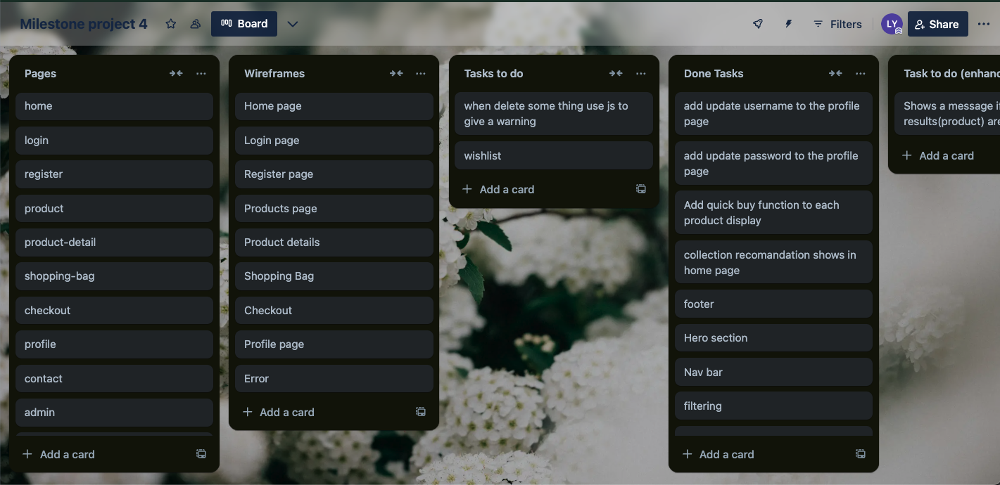

# [Japan Market](https://japan-market-1bc73d06bcba.herokuapp.com/)

[](https://github.com/Lauren21717/ms-4/commits/main)
[](https://github.com/Lauren21717/ms-4/commits/main)
[](https://github.com/Lauren21717/ms-4)


source: [amiresponsive](https://ui.dev/amiresponsive?url=https://japan-market-1bc73d06bcba.herokuapp.com/)

**Japan Market: Bringing the Essence of Japan to Your Doorstep**

Japan Market is an e-commerce web application built with Django, offering a curated selection of high-quality products made in Japan. Our platform features a wide range of items, including pet products, art, skincare, and cosmetics, all chosen for their exceptional craftsmanship and cultural significance. Designed with user experience in mind, Japan Market ensures a seamless shopping journey—from effortless browsing to a smooth and secure checkout process. With our diverse collection, we bring the essence of Japan to you, all in one convenient online marketplace.

## UX

### Colour Scheme


I used [coolors.co](https://coolors.co/304966-355070-7f4852-b25a61-e7847a-e99c84-eec285-f6dcb9-fef5ec-fffaf6) to generate my colour palette.


### Typography

#### Overview
Typography plays a crucial role in enhancing user experience and establishing a strong visual identity for Japan Market. Our font choices have been carefully selected to align with the elegant and high-quality aesthetic of Japanese products, ensuring a cohesive and engaging experience throughout the site.

#### Font Selections

 - [Libre Baskerville](https://fonts.google.com/specimen/Libre+Baskerville?query=Libre+Baskerville)\
   Used for primary headers and titles, Libre Baskerville provides an elegant and sophisticated look that reflects the premium nature of our products.
 - [Merriweather Sans](https://fonts.google.com/specimen/Merriweather+Sans?query=Merriweather)\
   Chosen for body text across the website, Merriweather Sans offers excellent legibility and a modern feel, complementing our overall design.

#### Conclusion
By combining Libre Baskerville and Merriweather, we create a cohesive and engaging user experience. Ensuring that the typography aligns with the elegant and high-quality aesthetic of Japanese products is vital for establishing a strong visual identity.

## User Stories

### New Site Users

- As a new user, I want to see a clear and recognizable logo so that I can easily remember the brand.

- As a new user, I want to understand what the site offers right away so that I know the types of products available.

- As a new user, I want to navigate through the site easily using the navigation bar so that I can find what I’m looking for.

- As a new user, I want to view a list of products so that I can browse through the available options.

- As a new user, I want to view detailed product pages so that I can understand the price, description, and specifications of each product.

- As a new user, I want to access a contact page so that I can reach out for assistance if needed.

- As a new user, I want to see social media links so that I can follow the brand for updates and promotions.

### Returning Site Users

- As a returning user, I want to register for an account so that I can save my purchase history and preferences.

- As a returning user, I want to log in to my account so that I can access my saved information quickly.

- As a returning user, I want to view my profile page so that I can update my delivery information and review past orders.

- As a returning user, I want to have access to personalized product recommendations based on my previous purchases so that I can discover new items.

- As a returning user, I want to save products to a wishlist so that I can keep track of items I want to buy later.

- As a returning user, I want to save products to a wishlist so that I can keep track of items I want to buy later.

- As a returning user, I want to add, edit, or delete reviews for products I’ve purchased so that I can share my feedback with others.

- As a returning user, I want to easily recover my password so that I can regain access to my account if I forget it.

- As a returning user, I want to securely log out so that my account remains safe on shared devices.

### Product Browsing and Navigation

- As a user, I want to filter products by category (e.g., pet products, skincare) so that I can find items of interest easily.

- As a user, I want to search for products by name or keywords so that I can quickly find specific items.

- As a user, I want to sort products by price, popularity, or rating so that I can find the best deals and top-rated items.

- As a user, I want to see highlighted deals and special offers so that I can take advantage of discounts.

- As a user, I want to view related products when looking at a product page so that I can explore similar items.

### Purchasing and Checkout

- As a user, I want to add items to my shopping cart so that I can keep track of what I want to buy.

- As a user, I want to view the contents of my shopping cart at any time so that I can review what I plan to purchase.

- As a user, I want to adjust the quantity of items in my cart so that I can change my order before checking out.

- As a user, I want to see a preview of my total cost, including shipping and tax, so that I know the full amount before paying.

- As a user, I want to save my payment details securely so that I can speed up the checkout process for future purchases.

- As a user, I want to receive an order confirmation email after making a purchase so that I have a record of my order.

- As a user, I want to track the status of my order from my account page so that I know when to expect delivery. 

### Admin and Store Management

- As an admin, I want to add new products to the store so that I can expand the product catalog.

- As an admin, I want to edit product details so that I can update prices, descriptions, and availability.

- As an admin, I want to delete products that are no longer available so that the store only lists current items.

- As an admin, I want to manage user reviews and delete inappropriate content so that the community remains respectful and helpful.

- As an admin, I want to view a list of all registered users so that I can manage accounts and respond to customer inquiries.

- As an admin, I want to view all orders placed so that I can monitor sales and ensure timely fulfillment.

- As an admin, I want to be able to send mass emails to users so that I can notify them of special promotions or announcements. 

- As an admin, I want to access a dashboard with sales reports so that I can understand the business’s performance. 

### Contact and Help

- As a user, I want to access a help page with frequently asked questions so that I can find quick solutions to common issues.

- As a user, I want to fill out a contact form to ask a question or report an issue so that I can receive support.

- As a user, I want to receive a confirmation email after submitting a contact form so that I know my inquiry has been received.

- As a user, I want to see customer reviews on product pages so that I can make informed purchase decisions.

- As an admin, I want to review messages submitted through the contact form so that I can address user concerns.

### Error Handling

- As a user, I want to see a friendly error message when I reach a 404 page so that I understand the page doesn't exist and can navigate back to the main site.

- As a user, I want to be redirected to a 403 page if I try to access unauthorized content so that I understand why access is restricted.

- As a user, I want to see a custom 500 error page if the site experiences a server issue so that I know the problem is being addressed.


## Wireframes

In line with best practices, wireframes were developed for mobile, tablet, and desktop sizes to ensure a consistent and optimized user experience across all devices.

I used [Balsamiq](https://balsamiq.com/wireframes) to create the wireframes for all screen sizes and [Figma](https://www.figma.com/) to develop an interactive prototype specifically for the mobile version of the site.

### Home page Wireframes

<details>
<summary> Click here to see the Home Page Wireframes </summary>

  - 
  - 

</details>

### Login page Wireframes

<details>
<summary> Click here to see the Login Page Wireframes </summary>

  - 

</details>

### Register page Wireframes

<details>
<summary> Click here to see the Register Page Wireframes </summary>

  - 

</details>

### Products page Wireframes

<details>
<summary> Click here to see the Products Page Wireframes </summary>

  - 
  - 

</details>

### Product details page Wireframes

<details>
<summary> Click here to see the Product details Page Wireframes </summary>

  - 
  - 

</details>

### Shopping Bag Wireframes

<details>
<summary> Click here to see the Shopping Bag Wireframes </summary>

  - 

</details>

### Checkout page Wireframes

<details>
<summary> Click here to see the Checkout Page Wireframes </summary>

  - 

</details>

### Profile page Wireframes

<details>
<summary> Click here to see the Profile Page Wireframes </summary>

  - 

</details>

### Contact page Wireframes

<details>
<summary> Click here to see the Contact Page Wireframes </summary>

  - 

</details>

### Error pages Wireframes

<details>
<summary> Click here to see the Contact Page Wireframes </summary>

  - 

</details>

## Features
### Existing Features

- **Home Page**
    - A visually appealing homepage with seamless navigation and personalized product recommendations for a smooth browsing experience.
	

- **Hero Image**
    - A striking hero image with a call-to-action button, guiding users directly to the collection page for easy exploration.
	

- **Visual Navigation with Images**
    - The collection section features visually appealing picture-based navigation, enhancing user engagement and providing an intuitive browsing experience.
	

- **Recommendations**
    - Features the latest products and exclusive offers, creating a fresh shopping experience with each visit.
	

- **Footer**
    - A helpful footer with "About Us", quick links, and social media icons, providing essential information and easy navigation.
	

- **Product Page**
    - A user-friendly product page that simplifies browsing with clear categories, helping users find products effortlessly.
	

- **Dynamic Headings and Descriptions**
	- Tailored headings and descriptions for each category, improving user navigation and product discovery.
	- 
	- 

- **Search Bar**
    - A versatile search bar that allows users to filter by product name, category, or feature, with helpful messages when no results are found.
	

- **Sort By**
    - Easy-to-use filters for sorting products by price, rating, and color, helping users refine their search to find the best options.
	- 
	- 

- **Quick Buy Button on each product card**
    - Convenient "Quick Buy" button on each product card, with a pop-up confirming the addition for a smooth shopping experience.
	
	

- **Bag Notification Toast**
    - Instant notifications alert users when items are added or removed from their shopping bag, keeping them informed in real time.
	

- **Shopping Bag Page**
    - A user-friendly page displaying items in the shopping bag, with options to edit or remove products. Costs update dynamically, ensuring transparency and convenience.
	

- **Product Detail Page**
    - Detailed product information including sizes, prices, descriptions, and customer reviews, empowering users to make informed purchases.
	

- **Adjust Size and Quantity**
    - Easy adjust size and quantity of items directly on the product detail page.
	

- **Reviews**
	- Enables customers to write, edit, and delete reviews, sharing valuable feedback to guide others in their shopping decisions.
	

- **Add/edit Review Page**
    - Users can add or edit product reviews, including descriptions and ratings, to share their experiences.
	- 
	- 

- **Delete Revies**
    - Users can easily delete their reviews, offering full control over their feedback.
	

- **Checkout Success**
	- A confirmation page post-checkout displaying all order details, offering reassurance and clarity to users.
	

- **Checkout Page**
	- A streamlined checkout experience where users can review delivery costs, total price, free delivery eligibility, and product details.
	

- **Profile Page**
    - Easy navigation to account details, order history, and other related pages, offering quick access to user information.
	

- **Account detail Page**
    - Allows users to view and edit their account information, including username, password, and delivery details.
	

- **Order History Page**
    - Displays a complete history of all past orders, helping users track their purchases.
	

- **Contact Page**
    - A contact form that allows users to reach out easily, with a confirmation email upon submission.
	

- **Registration Page**
	- A simple and intuitive registration page for users to create an account with ease.
	

- **Log In Page**
    - An easy-to-navigate login page, enabling users to securely log in to their accounts.
	

- #### Product Management
	- **Add Product**
		- Enables administrators to add new products to the platform with ease.
		
	
	- **Edit Product**
		- Allows administrators to edit product details, ensuring information remains up-to-date.
		
	
	- **Delete Product**
		- Gives administrators the ability to delete products from the site, keeping the catalog accurate and relevant.

	- **Edit/Delete Product Button under each button**
		- Provides easy management of products with buttons that appear only for administrators, ensuring seamless moderation of product listings.
		

- #### Error Handling

	- **403**
		- Alerts users that they lack the necessary permissions to access the requested page, maintaining security by restricting unauthorized access.
	
	- **404**
		- Informs users that the page they are looking for cannot be found, helping them understand that the URL may be incorrect or the page is no longer available.
	
	- **500**
		- Notifies users of a server-side error, keeping them informed while the issue is being addressed by the development team.

	- 

### Future Features

- Personalized Recommendations
	- Users will receive tailored product suggestions based on their previous purchases and browsing history. This will help them discover new and relevant items, enhancing their shopping experience and encouraging repeat visits.

- Wishlist Functionality
	- A wishlist feature will be added, allowing users to save products they are interested in. This will make it easier for them to keep track of items they wish to purchase later, creating a more user-friendly and engaging shopping experience.

- Order Tracking
	-  Users will have the ability to track the status of their orders directly from their account page. This feature will provide more transparency and convenience, keeping users informed about the progress and estimated delivery time of their purchases.

- Email Campaign Management
	-  Admins will be able to send mass emails to users for special promotions, product launches, or important announcements. This will help in keeping users engaged and informed about updates and exclusive offers.

- Business Analytics Dashboard
	-  An analytics dashboard will be developed for admins, providing insights into sales performance, user behavior, and popular products. This data-driven approach will assist in making informed decisions and optimizing the business strategy.


## Tools and Technologies Used

- **Design & Wireframing:**
  - [](https://balsamiq.com/wireframes) - For creating initial wireframes.
  - [](https://www.figma.com/) - For designing UI and refining wireframes.
  - [](https://www.canva.com/p/canvawireframes) - Additional wireframe and visual design support.

- **Version Control & Collaboration:**
  - [](https://git-scm.com) - For tracking code changes.
  - [](https://github.com) - Code repository for collaboration and hosting.
  - [](https://gitpod.io) - Cloud-based IDE for streamlined development.

- **Frontend Development:**
  - [](https://en.wikipedia.org/wiki/HTML) - Structure for web pages.
  - [](https://en.wikipedia.org/wiki/CSS) - Styling and layout.
  - [](https://getbootstrap.com) - For responsive design and UI components.
  - [](https://www.javascript.com) - Adds interactivity.
  - [](https://jquery.com) - Simplifies DOM manipulation and event handling.

- **Backend Development:**
  - [](https://www.python.org) - Backend programming language.
  - [](https://www.djangoproject.com) - Python framework for building the backend.
  - [](https://dbs.ci-dbs.net) - Database solution from Code Institute.

- **Hosting & Deployment:**
  - [](https://www.heroku.com) - Deployment platform for the backend.
  - [](https://aws.amazon.com/s3) - For storing static files.
  - [](https://whitenoise.readthedocs.io) - Serves static files efficiently with Heroku.

- **Payment & Email Services:**
  - [](https://stripe.com) - Processes secure online payments.
  - [](https://mail.google.com) - For sending emails.

- **Additional Tools:**
  - [](https://fonts.google.com) - Web fonts for typography.
  - [](https://lucide.dev) - Clean, lightweight icons that enhance the user interface.
  - [](https://code.visualstudio.com) - Local IDE for development.
  - [](https://chat.openai.com) - For assistance with content creation.
  - [](https://www.pinterest.co.uk/) - For design inspiration.
  - [](https://ezgif.com) - Converts screen recordings to GIFs for documentation.


## Database Design

Entity-Relationship Diagrams (ERDs) are crucial for visualizing database structures and relationships, ensuring efficient and organized data models. They serve as a foundation for seamless application development by clarifying table relationships and improving overall system design.

For **Japan Market**, the ERD highlights key entities like Users, Products, Orders, and the newly added Review model. It illustrates how these entities connect to create a cohesive shopping experience.

This is the ERD design prior to the development and using [dbdiagram.io](https://dbdiagram.io/home).


### Tools and Process:

I have used `pygraphviz` and `django-extensions` to auto-generate an ERD.

The steps taken were as follows:
- In the terminal: `sudo apt update`
- then: `sudo apt-get install python3-dev graphviz libgraphviz-dev pkg-config`
- then type `Y` to proceed
- then: `pip3 install django-extensions pygraphviz`
- in my `settings.py` file, I added the following to my `INSTALLED_APPS`:
```python
INSTALLED_APPS = [
    ...
    'django_extensions',
    ...
]
```
- back in the terminal: `python3 manage.py graph_models -a -o erd.png`
- dragged the new `erd.png` file into my `documentation/` folder
- removed `'django_extensions',` from my `INSTALLED_APPS`
- finally, in the terminal: `pip3 uninstall django-extensions pygraphviz -y`


source: [medium.com](https://medium.com/@yathomasi1/1-using-django-extensions-to-visualize-the-database-diagram-in-django-application-c5fa7e710e16)

This autogenerated ERD provides a comprehensive visualization of the relationships between all existing models, including the newly integrated Review model. It showcases the data structure, model connections, and dependencies, offering insights into how different parts of the application interact with each other.


## Agile Development Process

### Trello

- During the development process, I utilized [Trello](https://trello.com/) to monitor and manage the production workflow effectively. This tool allowed me to track tasks, prioritize features, and ensure deadlines were met.

	

### GitHub Issues

- [GitHub Issues](https://github.com/Lauren21717/ms-4/issues) served as another Agile tool, enabling task tracking and collaboration. It was especially helpful for managing milestones and iterations during the development process.

	  
	


## Testing

> [!NOTE]  
> For all testing, please refer to the [TESTING.md](TESTING.md) file.

## Deployment

The live deployed application can be found deployed on [Heroku](https://japan-market-1bc73d06bcba.herokuapp.com/).

### PostgreSQL Database

This project uses a [Code Institute PostgreSQL Database](https://dbs.ci-dbs.net).

To obtain my own Postgres Database from Code Institute, I followed these steps:

- Signed-in to the CI LMS using my email address.
- An email was sent to me with my new Postgres Database.

> [!CAUTION]  
> - PostgreSQL databases by Code Institute are only available to CI Students.
> - You must acquire your own PostgreSQL database through some other method
> if you plan to clone/fork this repository.
> - Code Institute students are allowed a maximum of 8 databases.
> - Databases are subject to deletion after 18 months.

### Amazon AWS

This project uses [AWS](https://aws.amazon.com) to store media and static files online, due to the fact that Heroku doesn't persist this type of data.

Once you've created an AWS account and logged-in, follow these series of steps to get your project connected.
Make sure you're on the **AWS Management Console** page.

#### S3 Bucket

- Search for **S3**.
- Create a new bucket, give it a name (matching your Heroku app name), and choose the region closest to you.
- Uncheck **Block all public access**, and acknowledge that the bucket will be public (required for it to work on Heroku).
- From **Object Ownership**, make sure to have **ACLs enabled**, and **Bucket owner preferred** selected.
- From the **Properties** tab, turn on static website hosting, and type `index.html` and `error.html` in their respective fields, then click **Save**.
- From the **Permissions** tab, paste in the following CORS configuration:

	```shell
	[
		{
			"AllowedHeaders": [
				"Authorization"
			],
			"AllowedMethods": [
				"GET"
			],
			"AllowedOrigins": [
				"*"
			],
			"ExposeHeaders": []
		}
	]
	```

- Copy your **ARN** string.
- From the **Bucket Policy** tab, select the **Policy Generator** link, and use the following steps:
	- Policy Type: **S3 Bucket Policy**
	- Effect: **Allow**
	- Principal: `*`
	- Actions: **GetObject**
	- Amazon Resource Name (ARN): **paste-your-ARN-here**
	- Click **Add Statement**
	- Click **Generate Policy**
	- Copy the entire Policy, and paste it into the **Bucket Policy Editor**

		```shell
		{
			"Id": "Policy1234567890",
			"Version": "2012-10-17",
			"Statement": [
				{
					"Sid": "Stmt1234567890",
					"Action": [
						"s3:GetObject"
					],
					"Effect": "Allow",
					"Resource": "arn:aws:s3:::your-bucket-name/*"
					"Principal": "*",
				}
			]
		}
		```

	- Before you click "Save", add `/*` to the end of the Resource key in the Bucket Policy Editor (like above).
	- Click **Save**.
- From the **Access Control List (ACL)** section, click "Edit" and enable **List** for **Everyone (public access)**, and accept the warning box.
	- If the edit button is disabled, you need to change the **Object Ownership** section above to **ACLs enabled** (mentioned above).

#### IAM

Back on the AWS Services Menu, search for and open **IAM** (Identity and Access Management).
Once on the IAM page, follow these steps:

- From **User Groups**, click **Create New Group**.
	- Suggested Name: `group-scrub-savers` (group + the project name)
- Tags are optional, but you must click it to get to the **review policy** page.
- From **User Groups**, select your newly created group, and go to the **Permissions** tab.
- Open the **Add Permissions** dropdown, and click **Attach Policies**.
- Select the policy, then click **Add Permissions** at the bottom when finished.
- From the **JSON** tab, select the **Import Managed Policy** link.
	- Search for **S3**, select the `AmazonS3FullAccess` policy, and then **Import**.
	- You'll need your ARN from the S3 Bucket copied again, which is pasted into "Resources" key on the Policy.

		```shell
		{
			"Version": "2012-10-17",
			"Statement": [
				{
					"Effect": "Allow",
					"Action": "s3:*",
					"Resource": [
						"arn:aws:s3:::your-bucket-name",
						"arn:aws:s3:::your-bucket-name/*"
					]
				}
			]
		}
		```
	
	- Click **Review Policy**.
	- Suggested Name: `policy-scrub-savers` (policy + the project name)
	- Provide a description:
		- "Access to S3 Bucket for scrub-savers static files."
	- Click **Create Policy**.
- From **User Groups**, click your "group-scrub-savers".
- Click **Attach Policy**.
- Search for the policy you've just created ("policy-scrub-savers") and select it, then **Attach Policy**.
- From **User Groups**, click **Add User**.
	- Suggested Name: `user-scrub-savers` (user + the project name)
- For "Select AWS Access Type", select **Programmatic Access**.
- Select the group to add your new user to: `group-scrub-savers`
- Tags are optional, but you must click it to get to the **review user** page.
- Click **Create User** once done.
- You should see a button to **Download .csv**, so click it to save a copy on your system.
	- **IMPORTANT**: once you pass this page, you cannot come back to download it again, so do it immediately!
	- This contains the user's **Access key ID** and **Secret access key**.
	- `AWS_ACCESS_KEY_ID` = **Access key ID**
	- `AWS_SECRET_ACCESS_KEY` = **Secret access key**

#### Final AWS Setup

- If Heroku Config Vars has `DISABLE_COLLECTSTATIC` still, this can be removed now, so that AWS will handle the static files.
- Back within **S3**, create a new folder called: `media`.
- Select any existing media images for your project to prepare them for being uploaded into the new folder.
- Under **Manage Public Permissions**, select **Grant public read access to this object(s)**.
- No further settings are required, so click **Upload**.

### Stripe API

This project uses [Stripe](https://stripe.com) to handle the ecommerce payments.

Once you've created a Stripe account and logged-in, follow these series of steps to get your project connected.

- From your Stripe dashboard, click to expand the "Get your test API keys".
- You'll have two keys here:
	- `STRIPE_PUBLIC_KEY` = Publishable Key (starts with **pk**)
	- `STRIPE_SECRET_KEY` = Secret Key (starts with **sk**)

As a backup, in case users prematurely close the purchase-order page during payment, we can include Stripe Webhooks.

- From your Stripe dashboard, click **Developers**, and select **Webhooks**.
- From there, click **Add Endpoint**.
	- `https://scrub-savers-7d53ee42bcc8.herokuapp.com/checkout/wh/`
- Click **receive all events**.
- Click **Add Endpoint** to complete the process.
- You'll have a new key here:
	- `STRIPE_WH_SECRET` = Signing Secret (Wehbook) Key (starts with **wh**)

### Gmail API

This project uses [Gmail](https://mail.google.com) to handle sending emails to users for account verification and purchase order confirmations.

Once you've created a Gmail (Google) account and logged-in, follow these series of steps to get your project connected.

- Click on the **Account Settings** (cog icon) in the top-right corner of Gmail.
- Click on the **Accounts and Import** tab.
- Within the section called "Change account settings", click on the link for **Other Google Account settings**.
- From this new page, select **Security** on the left.
- Select **2-Step Verification** to turn it on. (verify your password and account)
- Once verified, select **Turn On** for 2FA.
- Navigate back to the **Security** page, and you'll see a new option called **App passwords**.
- This might prompt you once again to confirm your password and account.
- Select **Mail** for the app type.
- Select **Other (Custom name)** for the device type.
	- Any custom name, such as "Django" or scrub-savers
- You'll be provided with a 16-character password (API key).
	- Save this somewhere locally, as you cannot access this key again later!
	- `EMAIL_HOST_PASS` = user's 16-character API key
	- `EMAIL_HOST_USER` = user's own personal Gmail email address

### Heroku Deployment

This project uses [Heroku](https://www.heroku.com), a platform as a service (PaaS) that enables developers to build, run, and operate applications entirely in the cloud.

Deployment steps are as follows, after account setup:

- Select **New** in the top-right corner of your Heroku Dashboard, and select **Create new app** from the dropdown menu.
- Your app name must be unique, and then choose a region closest to you (EU or USA), and finally, select **Create App**.
- From the new app **Settings**, click **Reveal Config Vars**, and set your environment variables.

> [!IMPORTANT]  
> This is a sample only; you would replace the values with your own if cloning/forking my repository.

| Key                     | Value                                                                |
| ----------------------- | -------------------------------------------------------------------- |
| `AWS_ACCESS_KEY_ID`     | user's own value                                                     |
| `AWS_SECRET_ACCESS_KEY` | user's own value                                                     |
| `DATABASE_URL`          | user's own value                                                     |
| `DISABLE_COLLECTSTATIC` | 1 (*this is temporary, and can be removed for the final deployment*) |
| `EMAIL_HOST_PASS`       | user's own value                                                     |
| `EMAIL_HOST_USER`       | user's own value                                                     |
| `SECRET_KEY`            | user's own value                                                     |
| `STRIPE_PUBLIC_KEY`     | user's own value                                                     |
| `STRIPE_SECRET_KEY`     | user's own value                                                     |
| `STRIPE_WH_SECRET`      | user's own value                                                     |
| `USE_AWS`               | True                                                                 |

Heroku needs three additional files in order to deploy properly.

- requirements.txt
- Procfile
- runtime.txt

You can install this project's **requirements** (where applicable) using:

- `pip3 install -r requirements.txt`

If you have your own packages that have been installed, then the requirements file needs updated using:

- `pip3 freeze --local > requirements.txt`

The **Procfile** can be created with the following command:

- `echo web: gunicorn app_name.wsgi > Procfile`
- *replace **app_name** with the name of your primary Django app name; the folder where settings.py is located*

The **runtime.txt** file needs to know which Python version you're using:
1. type: `python3 --version` in the terminal.
2. in the **runtime.txt** file, add your Python version:
	- `python-3.9.19`

For Heroku deployment, follow these steps to connect your own GitHub repository to the newly created app:

Either:

- Select **Automatic Deployment** from the Heroku app.

Or:

- In the Terminal/CLI, connect to Heroku using this command: `heroku login -i`
- Set the remote for Heroku: `heroku git:remote -a app_name` (replace *app_name* with your app name)
- After performing the standard Git `add`, `commit`, and `push` to GitHub, you can now type:
	- `git push heroku main`

The project should now be connected and deployed to Heroku!

### Local Deployment

This project can be cloned or forked in order to make a local copy on your own system.

For either method, you will need to install any applicable packages found within the *requirements.txt* file.

- `pip3 install -r requirements.txt`.

You will need to create a new file called `env.py` at the root-level,
and include the same environment variables listed above from the Heroku deployment steps.

> [!IMPORTANT]  
> This is a sample only; you would replace the values with your own if cloning/forking my repository.

Sample `env.py` file:

```python
import os

os.environ.setdefault("AWS_ACCESS_KEY_ID", "user's own value")
os.environ.setdefault("AWS_SECRET_ACCESS_KEY", "user's own value")
os.environ.setdefault("DATABASE_URL", "user's own value")
os.environ.setdefault("EMAIL_HOST_PASS", "user's own value")
os.environ.setdefault("EMAIL_HOST_USER", "user's own value")
os.environ.setdefault("SECRET_KEY", "user's own value")
os.environ.setdefault("STRIPE_PUBLIC_KEY", "user's own value")
os.environ.setdefault("STRIPE_SECRET_KEY", "user's own value")
os.environ.setdefault("STRIPE_WH_SECRET", "user's own value")

# local environment only (do not include these in production/deployment!)
os.environ.setdefault("DEBUG", "True")
```

Once the project is cloned or forked, in order to run it locally, you'll need to follow these steps:

- Start the Django app: `python3 manage.py runserver`
- Stop the app once it's loaded: `CTRL+C` or `⌘+C` (Mac)
- Make any necessary migrations: `python3 manage.py makemigrations`
- Migrate the data to the database: `python3 manage.py migrate`
- Create a superuser: `python3 manage.py createsuperuser`
- Load fixtures (if applicable): `python3 manage.py loaddata file-name.json` (repeat for each file)
- Everything should be ready now, so run the Django app again: `python3 manage.py runserver`

If you'd like to backup your database models, use the following command for each model you'd like to create a fixture for:

- `python3 manage.py dumpdata your-model > your-model.json`
- *repeat this action for each model you wish to backup*

#### Cloning

You can clone the repository by following these steps:

1. Go to the [GitHub repository](https://github.com/Lauren21717/ms-4) 
2. Locate the Code button above the list of files and click it 
3. Select if you prefer to clone using HTTPS, SSH, or GitHub CLI and click the copy button to copy the URL to your clipboard
4. Open Git Bash or Terminal
5. Change the current working directory to the one where you want the cloned directory
6. In your IDE Terminal, type the following command to clone my repository:
	- `git clone https://github.com/Lauren21717/ms-4`
7. Press Enter to create your local clone.

Alternatively, if using Gitpod, you can click below to create your own workspace using this repository.

[](https://gitpod.io/#https://github.com/Lauren21717/ms-4)

Please note that in order to directly open the project in Gitpod, you need to have the browser extension installed.
A tutorial on how to do that can be found [here](https://www.gitpod.io/docs/configure/user-settings/browser-extension).

#### Forking

By forking the GitHub Repository, we make a copy of the original repository on our GitHub account to view and/or make changes without affecting the original owner's repository.
You can fork this repository by using the following steps:

1. Log in to GitHub and locate the [GitHub Repository](https://github.com/Lauren21717/ms-4)
2. At the top of the Repository (not top of page) just above the "Settings" Button on the menu, locate the "Fork" Button.
3. Once clicked, you should now have a copy of the original repository in your own GitHub account!

### Local VS Deployment

There is no difference between the local version and the deployed version.

## Credits

### Content

- **[Pinterest](https://www.pinterest.com/)** - Images for the hero section.
- **[Codecademy](https://www.codecademy.com/)** - Tutorial on building a Django web application.
- **[mikavir scrub-savers](https://github.com/mikavir/scrub-savers/tree/main)** - Referenced for README structure and best practices.
- **[W3C](https://www.w3.org/)** - Guides and resources for web standards and best practices.
- **[YouTube](https://www.youtube.com/)** - Resources and tutorials on how to make a review app in Django.
- **[Code Institute - Boutique Ado](https://github.com/Code-Institute-Community/boutique-ado)** - MS4: making an e-commerce project with Django.
- **[ChatGPT](https://chat.openai.com/)** - Content assistance and code checking.
- **[Claude](https://claude.ai/new)** - Content assistance and code checking.
- **[CS50's Web Programming with Python and JavaScript](https://www.edx.org/course/cs50s-web-programming-with-python-and-javascript)** - Provided foundational knowledge and tutorials for building the web application.


### Media
- **[Canva](https://www.canva.com/)** - Used for photo editing and creating design elements.
- **[Google](https://www.google.com/)** - Provided product images and inspiration for navigation and hero image.
- **[ezgif.com](https://ezgif.com/)** - Used to convert videos to GIFs for documentation.


### Acknowledgements

I would like to express my gratitude to the following:

- The Code Institute Slack community for their moral support; it kept me going during periods of self-doubt and imposter syndrome.
- I would like to thank the Code Institute tutor team for their assistance with troubleshooting and debugging some project issues.
- My friends for generously dedicating their time to test the game and provide valuable feedback.