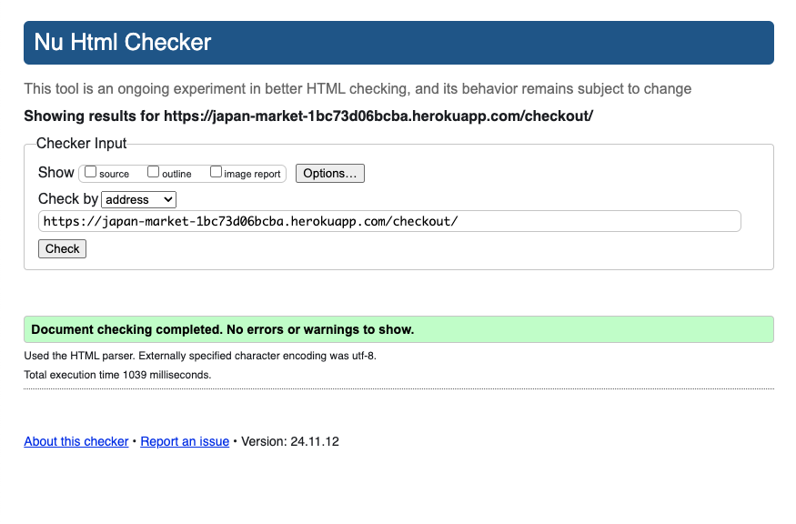
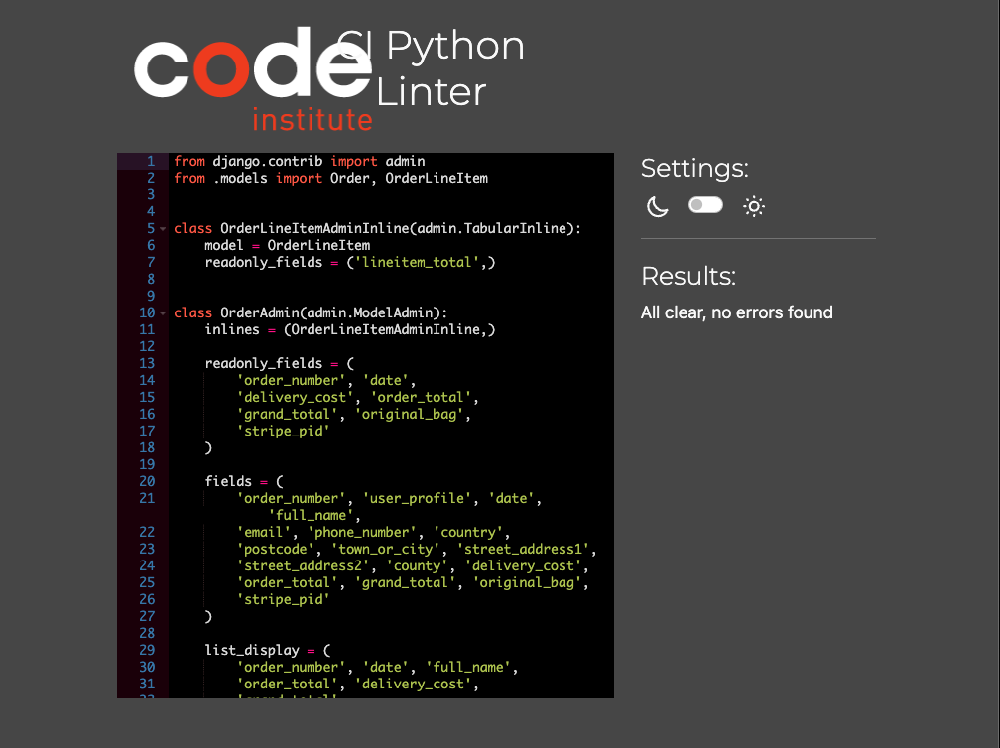
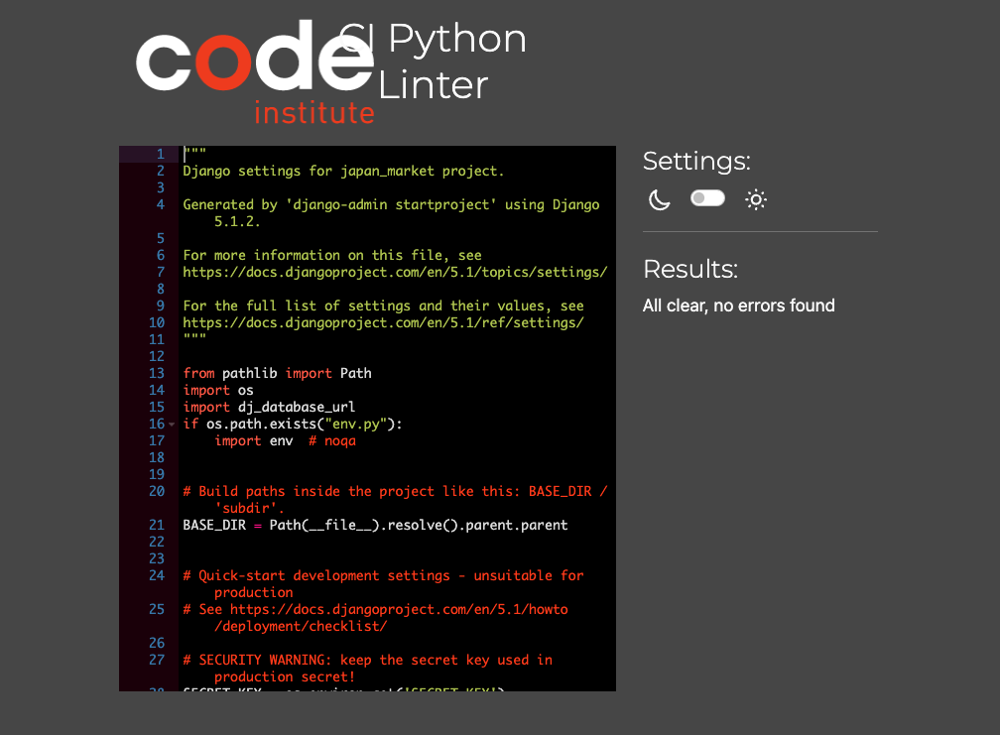
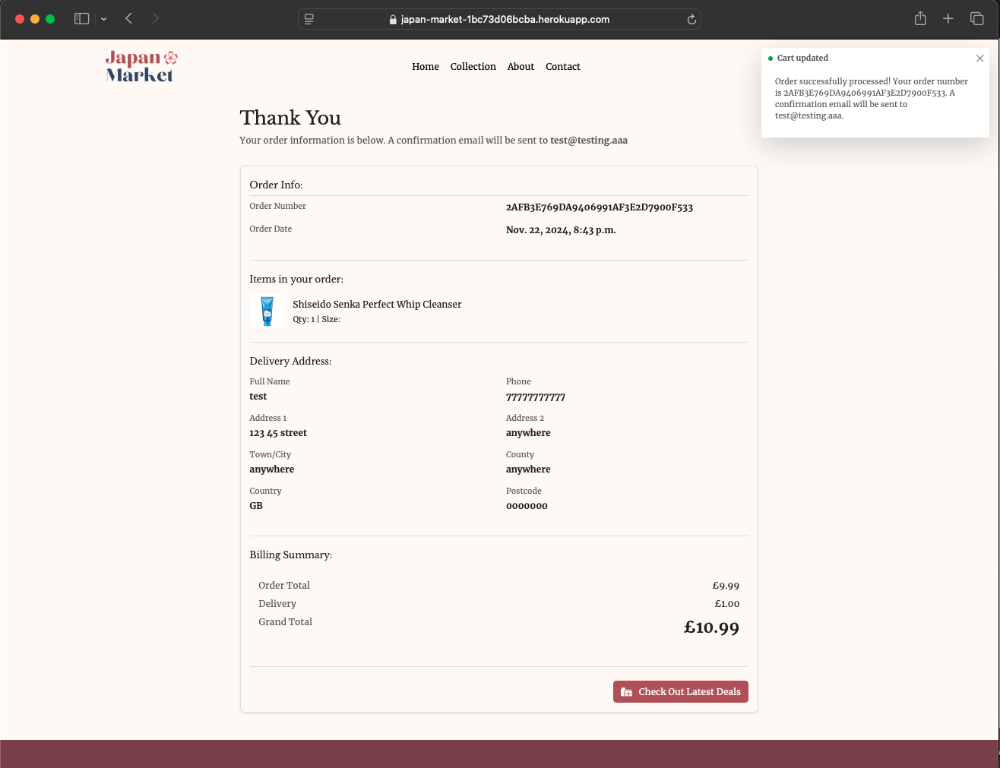
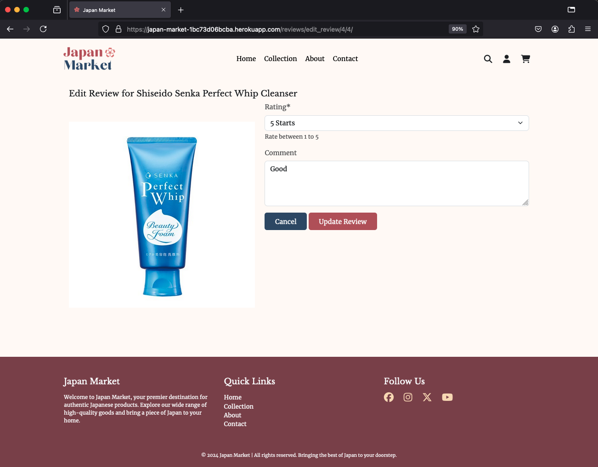
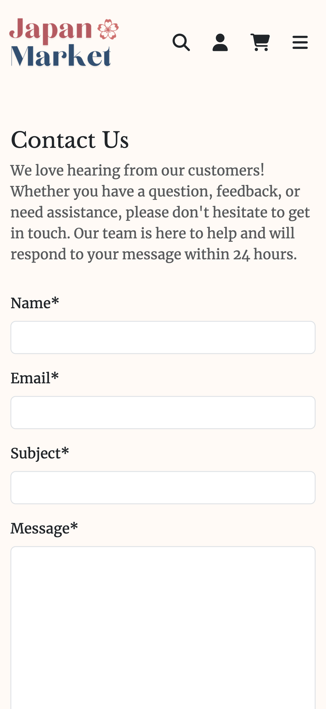
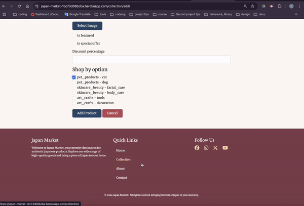
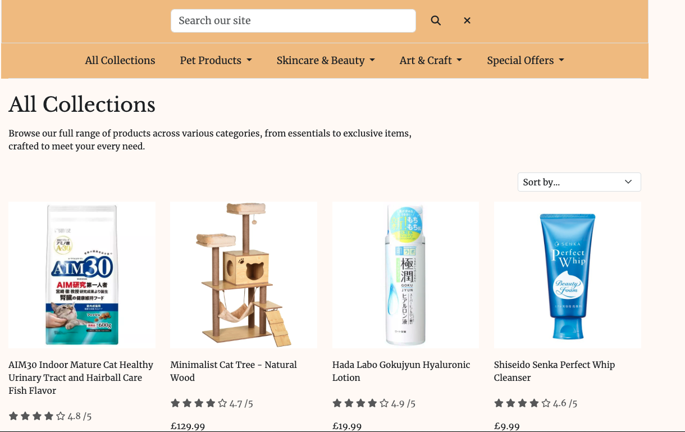
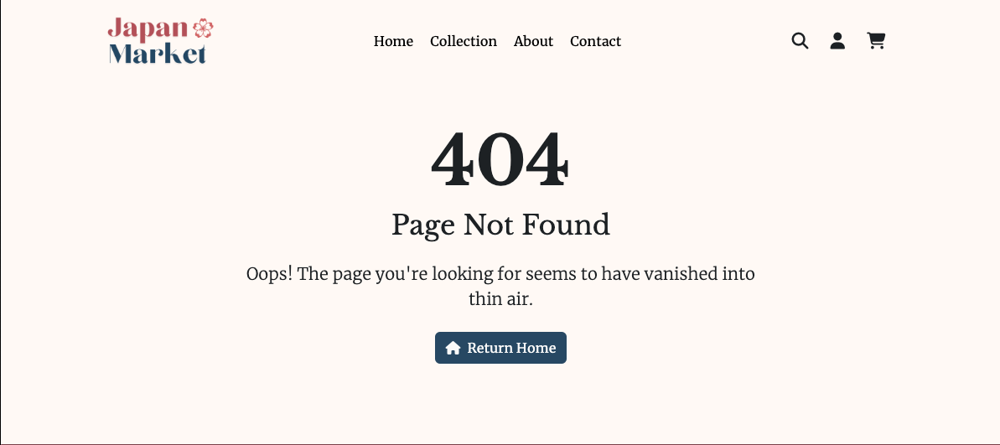

# Testing

> [!NOTE]  
> Return back to the [README.md](README.md) file.


## Code Validation

### HTML

I have used the recommended [HTML W3C Validator](https://validator.w3.org) to validate all of my HTML files.

| Directory | File | Screenshot | Notes |
| --- | --- | --- | --- |
| about | about.html |  | No Errors |
| home | index.html |  | No Errors |
| bag | bag.html |  | No Errors |
| checkout | checkout.html |  | No Errors |
| checkout | checkout_success.html |  | No Errors |
| collection | add_product.html |  | No Errors |
| collection | edit_product.html |  | No Errors |
| collection | collection.html |  | No Errors |
| collection | product_detail.html |  | No Errors |
| contact | contact.html |  | No Errors |
| contact | success.html |  | No Errors |
| profile | profile.html |  | No Errors |
| profile | account_detail.html |  | No Errors |
| profile | order_history.html |  | No Errors |
| review | add_review.html |  | No Errors |
| review | edit_review.html |  | No Errors |


### CSS

I have used the recommended [CSS Jigsaw Validator](https://jigsaw.w3.org/css-validator) to validate all of my CSS files.

| Directory | File | Screenshot | Notes |
| --- | --- | --- | --- |
| static | base.css |  | No errors |
| profile | profile.css |  | No errors |
| home | home.css |  | No errors |
| checkout | checkout.css |  | No errors |

### JavaScript

I have used the recommended [JShint Validator](https://jshint.com) to validate all of my JS files.

| Directory | File | Screenshot | Notes |
| --- | --- | --- | --- |
| checkout | stripe_elements.js |  | ES6 syntax validated and undefined variables from Stripe API, no critical errors found |
| profile | countryfield.js |  | ES6 syntax validated, no critical errors found |
| static | script.js |  | ES6 syntax validated, no critical errors found |
### Python

I have used the recommended [PEP8 CI Python Linter](https://pep8ci.herokuapp.com) to validate all of my Python files.

| Directory | File | CI URL | Screenshot | Notes |
| --- | --- | --- | --- | --- |
| about | urls.py |  | [PEP8CI](https://pep8ci.herokuapp.com/https://raw.githubusercontent.com/Lauren21717/ms-4/main/about/urls.py) | No error |
| about | views.py |  | [PEP8CI](https://pep8ci.herokuapp.com/https://raw.githubusercontent.com/Lauren21717/ms-4/main/about/views.py) | No error |
| bag | contexts.py |  | [PEP8CI](https://pep8ci.herokuapp.com/https://raw.githubusercontent.com/Lauren21717/ms-4/main/bag/contexts.py) | No error |
| bag | urls.py |  | [PEP8CI](https://pep8ci.herokuapp.com/https://raw.githubusercontent.com/Lauren21717/ms-4/main/bag/urls.py) | No error |
| bag | views.py |  | [PEP8CI](https://pep8ci.herokuapp.com/https://raw.githubusercontent.com/Lauren21717/ms-4/main/bag/views.py) | No error |
| bag | bag_tools.py |  | [PEP8CI](https://pep8ci.herokuapp.com/https://raw.githubusercontent.com/Lauren21717/ms-4/main/bag/templatetags/bag_tools.py) | No error |
| checkout | admin.py |  | [PEP8CI](https://pep8ci.herokuapp.com/https://raw.githubusercontent.com/Lauren21717/ms-4/main/checkout/admin.py) | No error |
| checkout | forms.py |  | [PEP8CI](https://pep8ci.herokuapp.com/https://raw.githubusercontent.com/Lauren21717/ms-4/main/checkout/forms.py) | No error |
| checkout | models.py |  | [PEP8CI](https://pep8ci.herokuapp.com/https://raw.githubusercontent.com/Lauren21717/ms-4/main/checkout/models.py) | No error |
| checkout | signals.py |  | [PEP8CI](https://pep8ci.herokuapp.com/https://raw.githubusercontent.com/Lauren21717/ms-4/main/checkout/signals.py) | No error |
| checkout | urls.py |  | [PEP8CI](https://pep8ci.herokuapp.com/https://raw.githubusercontent.com/Lauren21717/ms-4/main/checkout/urls.py) | No error |
| checkout | views.py |  | [PEP8CI](https://pep8ci.herokuapp.com/https://raw.githubusercontent.com/Lauren21717/ms-4/main/checkout/views.py) | No error |
| checkout | webhook_handler.py |  | [PEP8CI](https://pep8ci.herokuapp.com/https://raw.githubusercontent.com/Lauren21717/ms-4/main/checkout/webhook_handler.py) | No error |
| checkout | webhook |  | [PEP8CI](https://pep8ci.herokuapp.com/https://raw.githubusercontent.com/Lauren21717/ms-4/main/checkout/webhook.py) | No error |
| collection | admin.py |  | [PEP8CI](https://pep8ci.herokuapp.com/https://raw.githubusercontent.com/Lauren21717/ms-4/main/collection/admin.py) | No error |
| collection | forms.py |  | [PEP8CI](https://pep8ci.herokuapp.com/https://raw.githubusercontent.com/Lauren21717/ms-4/main/collection/forms.py) | No error |
| collection | models.py |  | [PEP8CI](https://pep8ci.herokuapp.com/https://raw.githubusercontent.com/Lauren21717/ms-4/main/collection/models.py) | No error |
| collection | signals.py |  | [PEP8CI](https://pep8ci.herokuapp.com/https://raw.githubusercontent.com/Lauren21717/ms-4/main/collection/signals.py) | No error |
| collection | urls.py |  | [PEP8CI](https://pep8ci.herokuapp.com/https://raw.githubusercontent.com/Lauren21717/ms-4/main/collection/urls.py) | No error |
| collection | views.py |  | [PEP8CI](https://pep8ci.herokuapp.com/https://raw.githubusercontent.com/Lauren21717/ms-4/main/collection/views.py) | No error |
| collection | widgets.py |  | [PEP8CI](https://pep8ci.herokuapp.com/https://raw.githubusercontent.com/Lauren21717/ms-4/main/collection/widgets.py) | No error |
| contact | admin.py |  | [PEP8CI](https://pep8ci.herokuapp.com/https://raw.githubusercontent.com/Lauren21717/ms-4/main/contact/admin.py) | No error |
| contact | forms.py |  | [PEP8CI](https://pep8ci.herokuapp.com/https://raw.githubusercontent.com/Lauren21717/ms-4/main/contact/forms.py) | No error |
| contact | models.py |  | [PEP8CI](https://pep8ci.herokuapp.com/https://raw.githubusercontent.com/Lauren21717/ms-4/main/contact/models.py) | No error |
| contact | urls.py |  | [PEP8CI](https://pep8ci.herokuapp.com/https://raw.githubusercontent.com/Lauren21717/ms-4/main/contact/urls.py) | No error |
| contact | views.py |  | [PEP8CI](https://pep8ci.herokuapp.com/https://raw.githubusercontent.com/Lauren21717/ms-4/main/contact/views.py) | No error |
| home | views.py |  | [PEP8CI](https://pep8ci.herokuapp.com/https://raw.githubusercontent.com/Lauren21717/ms-4/main/home/views.py) | No error |
| home | urls.py |  | [PEP8CI](https://pep8ci.herokuapp.com/https://raw.githubusercontent.com/Lauren21717/ms-4/main/home/urls.py) | No error |
| profiles | admin.py |  | [PEP8CI](https://pep8ci.herokuapp.com/https://raw.githubusercontent.com/Lauren21717/ms-4/main/profiles/admin.py) | No error |
| profiles | forms.py |  | [PEP8CI](https://pep8ci.herokuapp.com/https://raw.githubusercontent.com/Lauren21717/ms-4/main/profiles/forms.py) | No error |
| profiles | models.py |  | [PEP8CI](https://pep8ci.herokuapp.com/https://raw.githubusercontent.com/Lauren21717/ms-4/main/profiles/models.py) | No error |
| profiles | urls.py |  | [PEP8CI](https://pep8ci.herokuapp.com/https://raw.githubusercontent.com/Lauren21717/ms-4/main/profiles/urls.py) | No error |
| profiles | views.py |  | [PEP8CI](https://pep8ci.herokuapp.com/https://raw.githubusercontent.com/Lauren21717/ms-4/main/profiles/views.py) | No error |
| reviews | admin.py |  | [PEP8CI](https://pep8ci.herokuapp.com/https://raw.githubusercontent.com/Lauren21717/ms-4/main/reviews/admin.py) | No error |
| reviews | forms.py |  | [PEP8CI](https://pep8ci.herokuapp.com/https://raw.githubusercontent.com/Lauren21717/ms-4/main/reviews/forms.py) | No error |
| reviews | models.py |  | [PEP8CI](https://pep8ci.herokuapp.com/https://raw.githubusercontent.com/Lauren21717/ms-4/main/reviews/models.py) | No error |
| reviews | urls.py |  | [PEP8CI](https://pep8ci.herokuapp.com/https://raw.githubusercontent.com/Lauren21717/ms-4/main/reviews/urls.py) | No error |
| reviews | views.py |  | [PEP8CI](https://pep8ci.herokuapp.com/https://raw.githubusercontent.com/Lauren21717/ms-4/main/reviews/views.py) | No error |
| japan_market | settings.py |  | [PEP8CI](https://pep8ci.herokuapp.com/https://raw.githubusercontent.com/Lauren21717/ms-4/main/japan_market/settings.py) | No error |
| japan_market | urls.py |  | [PEP8CI](https://pep8ci.herokuapp.com/https://raw.githubusercontent.com/Lauren21717/ms-4/main/japan_market/urls.py) | No error |
| japan_market | views.py |  | [PEP8CI](https://pep8ci.herokuapp.com/https://raw.githubusercontent.com/Lauren21717/ms-4/main/japan_market/views.py) | No error |

## Browser Compatibility


I've tested my deployed project on multiple browsers to check for compatibility issues.

| Browser | Home | About | Contact | Collection | Notes |
| --- | --- | --- | --- | --- | --- |
| Chrome |   |  |  |  | Works as expected |
| Firefox |   |  |  |  | Works as expected |
| Safari |   |  |  |  | Works as expected |

| Browser | Product Detail | Bag | Checkout | Checkout Success | Notes |
| --- | --- | --- | --- | --- | --- |
| Chrome |  |  |  |  | Works as expected |
| Firefox |  |  |  |  | Works as expected |
| Safari |  |  |  |  | Works as expected |

| Browser | Login | Register | Profile | Account Detail | Notes |
| --- | --- | --- | --- | --- | --- |
| Chrome |  |  |  |  | Works as expected |
| Firefox |  |  |  |  | Works as expected |
| Safari |  |  |  |  | Works as expected |

| Browser | Order History | Add Review | Edit Review | Add Product | Edit Product | Notes |
| --- | --- | --- | --- | --- | --- | -- |
| Chrome |  |  |  |  |   Works as expected |
| Firefox |  |  |  |  |   Works as expected |
| Safari |  |  |  |  |   Works as expected |


## Responsiveness


I've tested my deployed project on multiple devices to check for responsiveness issues.

| Device | Home | About | Contact | Collection | Notes |
| --- | --- | --- | --- | --- | --- |
| Mobile (DevTools)|  |  |  |  | Works as expected |
| Tablet (DevTools) |  |  |  |  | Works as expected |
| Desktop |  |  |  |  | Works as expected |

| Device | Product Detail | Bag | Checkout | Checkout Success | Notes |
| --- | --- | --- | --- | --- | --- |
| Mobile (DevTools) (375px x 667px) |  |  |  |  | Works as expected |
| Tablet (DevTools) |  |  |  |  | Works as expected |
| Desktop |  |  |  |  | Works as expected |

| Device | Login | Register | Profile | Account Detail | Notes |
| --- | --- | --- | --- | --- | --- |
| Mobile (DevTools) (375px x 667px) |  |  |  |  | Works as expected |
| Tablet (DevTools) |  |  |  |  | Works as expected |
| Desktop |  |  |  |  | Works as expected |


| Device | Order History | Add Review | Edit Review | Add Product | Edit Product | Notes |
| --- | --- | --- | --- | --- | --- | --- |
| Mobile (DevTools) (375px x 667px) |  |  |  |  |  |  Works as expected |
| Tablet (DevTools) |  |  |  |  |  | Works as expected |
| Desktop |  |  |  |  |  | Works as expected |

## Lighthouse Audit

I've tested my deployed project using the Lighthouse Audit tool to check for any major issues.

| Page | Mobile | Desktop | Notes |
| --- | --- | --- | --- |
| Home |  |  | Images not in next-gen formats (due to Amazon S3). Render-blocking resources (Bootstrap, FontAwesome, Stripe) impact performance but are essential. |
| About |  |  | Same as above. Image optimization and render-blocking resources need attention. |
| Contact |  |  |Render-blocking resources (Bootstrap, FontAwesome, Stripe) impact performance but are essential. |
| Collection |  |  | Images not in next-gen formats (due to Amazon S3). Render-blocking resources (Bootstrap, FontAwesome, Stripe) impact performance but are essential |
| Product Detail |  |  | Images not in next-gen formats (due to Amazon S3). Render-blocking resources (Bootstrap, FontAwesome, Stripe) impact performance but are essential |
| Bag |  |  | Images not in next-gen formats (due to Amazon S3). Render-blocking resources (Bootstrap, FontAwesome, Stripe) impact performance but are essential |
| Checkout |  |  | Slow response time due to large images |
| Checkout Success |  |  | Images not in next-gen formats (due to Amazon S3). Render-blocking resources (Bootstrap, FontAwesome, Stripe) impact performance but are essentials |
| Login |  |  | Render-blocking resources (Bootstrap, FontAwesome, Stripe) impact performance but are essential |
| Register |  |  | Render-blocking resources (Bootstrap, FontAwesome, Stripe) impact performance but are essential |
| Profile |  |  | Render-blocking resources (Bootstrap, FontAwesome, Stripe) impact performance but are essential |
| Account Detail |  |  | Images not in next-gen formats (due to Amazon S3). Render-blocking resources (Bootstrap, FontAwesome, Stripe) impact performance but are essentials |
| Order History |  |  | Render-blocking resources (Bootstrap, FontAwesome, Stripe) impact performance but are essentials |
| Add Review |  |  | Render-blocking resources (Bootstrap, FontAwesome, Stripe) impact performance but are essentials |
| Edit Review |  |  | Render-blocking resources (Bootstrap, FontAwesome, Stripe) impact performance but are essentials |
| Add Product |  |  | Render-blocking resources (Bootstrap, FontAwesome, Stripe) impact performance but are essentials |
| Edit Product |  |  | Render-blocking resources (Bootstrap, FontAwesome, Stripe) impact performance but are essentials |

## Defensive Programming

Defensive programming was manually tested using user acceptance testing as detailed below:

---

### Restricted Pages and Admin Authentication

| Page | Expectation | Test | Result | Fix| Screenshot|
| --- | --- | --- | --- | --- | --- |
| Profile | Logged-out users should be redirected to the sign-in page when accessing the profile URL. | Brute-forced the URL to the profile page. | Feature behaved as expected. | Test concluded and passed. |  |
| Checkout Success | Logged-out users should not access other users' checkout-success pages. | Brute-forced the URL to a checkout-success page while logged out. | Feature failed to restrict access. Documented as an unfixed bug. | Unable to fix. |  |
| Add Product | Only admins should have access to this page. | Brute-forced the URL to the Add Product page.| Feature behaved as expected. | Test concluded and passed. |  |
| Edit Product  | Only admins should have access to this page. | Brute-forced the URL to the Edit Product page. | Feature behaved as expected. | Test concluded and passed. |  |
| Add Review | Logged-out users should be redirected to the sign-in page. | Tested by brute-forcing the Add Review page URL. | Feature behaved as expected. | Test concluded and passed. |  |
| | Users who haven't bought the product should receive an error message when attempting to add a review. | Tested by navigating as a non-verified buyer. | Feature behaved as expected. | Test concluded and passed. |  |
| Edit Review | Users should not be able to edit others' reviews and should receive an error message. | Tested by attempting to edit another user’s review. | Feature behaved as expected. | Test concluded and passed. |  |

---

### CRUD Functionality

| Page | Expectation | Test | Result | Fix| Screenshot|
| --- | --- | --- | --- | --- | --- |
| Add Product| Admins can add products. | Tested by completing the form and adding a product as an admin. | Feature behaved as expected. | Test concluded and passed. |  |
| Edit Product  | Admins can edit products. | Tested by completing the form and editing a product as an admin. | Feature behaved as expected. | Test concluded and passed. |  |
| Delete Product | Admins can delete products. | Tested by deleting a product as an admin. | Feature behaved as expected. | Test concluded and passed. |  |
| Add Review | Verified buyers can add reviews. | Tested by completing the form and adding a review as a verified buyer. | Feature behaved as expected. | Test concluded and passed. |  |
| Edit Review | Verified buyers can edit their own reviews. | Tested by completing the form and editing a review as the original reviewer. | Feature behaved as expected. | Test concluded and passed. |  |
| Delete Review | Verified buyers can delete their own reviews. | Tested by deleting a review as the original reviewer. | Feature behaved as expected. | Test concluded and passed. |  |
| Profile | Users can update their personal details. | Tested by updating the profile form. | Feature behaved as expected. | Test concluded and passed. |  |

---

### Form Validation

| Page | Expectation | Test | Result | Fix| Screenshot|
| --- | --- | --- | --- | --- | --- |
| Add Product | The form should not submit with missing required fields. | Tested by submitting an incomplete form. | Feature behaved as expected. | Test concluded and passed. |  |
| Edit Product | The form should not submit with missing required fields. | Tested by submitting an incomplete form. | Feature behaved as expected. | Test concluded and passed. |  |
| Contact | The form should not submit without a message. | Tested by submitting the form without entering a message. | Feature behaved as expected. | Test concluded and passed. |  |


## User Story Testing

## User Story Testing

| User Story | Screenshot |
| --- | --- |
| As a new site user, I want to see a clear and recognizable logo so that I can easily remember the brand. |  |
| As a new site user, I want to understand what the site offers right away so that I know the types of products available. |  |
| As a new site user, I want to navigate through the site easily using the navigation bar so that I can find what I’m looking for. |  |
| As a new site user, I want to view a list of products so that I can browse through the available options. |  |
| As a returning site user, I want to log in to my account so that I can access my saved information quickly. |  |
| As a returning site user, I want to save products to a wishlist so that I can keep track of items I want to buy later. | Future Feature |
| As a user, I want to filter products by category (e.g., pet products, skincare) so that I can find items of interest easily. |  |
| As a user, I want to add items to my shopping cart so that I can keep track of what I want to buy. |  |
| As a site administrator, I should be able to add new products to the store so that I can expand the product catalog. |  |
| As a site administrator, I should be able to delete products that are no longer available so that the store only lists current items. |  |
| As a user, I want to see a friendly error message when I reach a 404 page so that I understand the page doesn't exist and can navigate back to the main site. |  |


## Automated Testing

This project did not include automated testing due to time constraints and the primary focus being on manual testing to ensure core functionality. All features were rigorously tested manually to verify their behavior against the defined user stories and acceptance criteria. While automated testing was not implemented, future development plans include integrating automated testing tools, such as Selenium or Pytest, to streamline the testing process and ensure consistent quality assurance for ongoing updates.


## Bugs

- **Logout Button Does Not Work**
    - When the logout button is clicked, the user is not logged out as expected.
    - 
    - To resolve the issue, the following line was added to the `settings.py` file:
        ```python
        # Ensures logout is performed on a GET request
        ACCOUNT_LOGOUT_ON_GET = True
    - 


## Unfixed Bugs

- **Known Bug: URL Brute-Forcing for Checkout Confirmation**
    - 
    - A vulnerability allows users to brute-force the URL of another user's checkout-success page if they know the URL. While this issue exists, fixing it would require preventing unsigned users from purchasing products, which is a limitation discussed in the Code Institute's Boutique Ado walkthrough. The risk is reduced because the URLs are unique, making it unlikely for users to guess them. Future updates may consider adding more security to address this.


> [!NOTE]  
> There are no remaining bugs that I am aware of.
